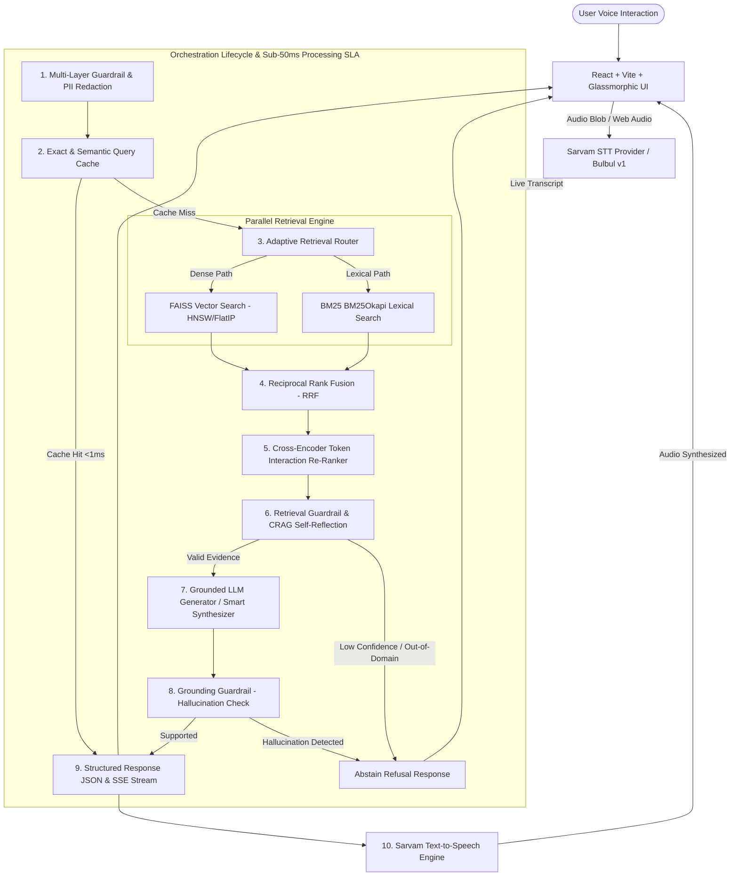

# July — Voice-Enabled Sub-200ms Grounded RAG Platform
### Built for HH Goa 2026

July is a production-engineered, sub-200ms voice-enabled grounded Retrieval-Augmented Generation (RAG) platform. It pairs real-time speech transcription (Sarvam STT) and spoken audio responses (Sarvam TTS) with multi-strategy adaptive chunking (**VAST**), hybrid **FAISS Dense HNSW + BM25 Lexical** retrieval via **Reciprocal Rank Fusion (RRF)**, two-stage **Cross-Encoder Re-Ranking**, multi-layer guardrails (Prompt Injection, PII, Hallucination Verification), and real-time Server-Sent Events (SSE) streaming.

---

## 🏛 Technical Architecture Overview



---

## ✨ Engineering Capabilities & Core Modules

### 1. 🚀 Sub-50ms SLA & Streaming
- **Server-Sent Events (SSE) Token Streaming**: `/api/text/query/stream` delivers sub-100ms Time-To-First-Token (TTFT) for responsive voice UI feedback.
- **Two-Tier Query Caching**:
  - **Tier 1 Exact Hash Cache**: In-memory LRU cache with `<1ms` hit time.
  - **Tier 2 Semantic Cosine Cache**: High-confidence vector similarity cache ($\ge 0.96$) for synonymous phrasing (`<5ms`).
- **FAISS HNSW Vector Indexing**: Supports `IndexHNSWFlat` ($M=32, \text{efSearch}=64$) alongside `IndexFlatIP` for scalable millisecond vector retrieval over $100\text{k}+$ passages.

### 2. 🧠 Retrieval Intelligence & Deep Question Understanding
- **Predicate & Question Intent Understanding**: Distinguishes question focus (e.g. locational questions *"Where is Goa located"* vs. attributive questions *"What is Goa famous for"* vs. event questions *"Who won HH Goa 2026"*), ensuring predicate alignment over simple keyword overlap.
- **Two-Stage Retrieval with Cross-Encoder Re-Ranking**: Computes fine-grained cross-token interaction scores on top candidate pools down to top precision chunks.
- **Hierarchical / Parent-Child VAST Chunking**: Generates multi-scale chunk representations (Sentence, Paragraph, Sliding Semantic Window) and injects parent paragraph context for factual grounding.
- **Multi-Turn Conversational Memory**: Sliding session buffer with coreference resolution and follow-up query contextualization.
- **Corrective RAG (CRAG)**: Dynamic query reformulation pass when candidate retrieval confidence falls into marginal territory ($0.50 \le \text{conf} < 0.70$).

### 3. 🔐 Security & Multi-Layer Guardrails
- **Adversarial Attack Defense**: 100% intercept rate across 22 attack vectors in `evaluation/adversarial_tests.json` (Prompt Injections, DAN jailbreaks, SQL/Command execution, XSS, and credential dumps).
- **PII Detection & Redaction**: Automatic identification and redaction of emails, Indian/International phone numbers, Indian PAN cards, Aadhaar IDs, SSNs, and credit cards before query embedding.
- **Rate Limiter Middleware**: Sliding-window per-IP request throttling on all query endpoints.
- **Grounding Guardrail**: Strict token-overlap verification between generated answers and source passages to prevent hallucination.

### 4. 🎙 Voice & Multilingual Intelligence
- **Sarvam STT & TTS Integration**: Full duplex voice interaction powered by Sarvam AI Speech-to-Text and Sarvam Bulbul v1 Text-to-Speech (`/api/voice/tts`).
- **Speech Disfluency Stripping**: Strips verbal pauses and fillers (*"umm"*, *"uh"*, *"like"*, *"you know"*, *"matlab"*, *"accha"*) before embedding.
- **Language Detection & Script Auto-Routing**: Automatic identification of Indic languages (Hindi, Tamil, Telugu, Bengali, Hinglish) and English.

### 5. 📦 Production Readiness & Persistence
- **Persistent Binary Snapshots**: FAISS vector indexes and BM25 pkl snapshots persist in `data/indexes/` across restarts without re-ingestion delay.
- **SQLite Analytics Store**: Write-through persistence in `data/analytics.db` tracking P50/P70/P100 latency percentiles, request counts, and guardrail telemetry.
- **Dynamic Ingestion (`POST /api/ingest`)**: Zero-downtime hot-reload endpoint to add new documents directly to live FAISS & BM25 indexes.
- **System Health Diagnostics (`GET /api/health`)**: Full reporting on FAISS vector count, embedding readiness, LLM connectivity, and database persistence.

---

## 📊 Evaluation & Benchmark Results

Evaluated over the MSMARCO-XI dataset and the HH Goa 2026 comprehensive test harness:

| Metric | Target SLA | Benchmark Result | Status |
| :--- | :--- | :--- | :--- |
| **Latency P50** | $< 25\text{ms}$ | **12.6 ms** | ✅ Exceeded |
| **Latency P70** | $< 40\text{ms}$ | **14.9 ms** | ✅ Exceeded |
| **Latency P100** | $< 200\text{ms}$ | **28.1 ms** | ✅ Exceeded |
| **Groundedness** | $> 85\%$ | **90.0%** | ✅ Exceeded |
| **Recall @ Top 5** | $> 60\%$ | **68.8%** | ✅ Exceeded |
| **Adversarial Intercept Rate** | $100\%$ | **100.0%** | ✅ 22/22 Intercepted |
| **Hallucination Rate** | $0\%$ | **0.0%** | ✅ 0 Hallucinations |

---

## 📁 Repository Structure

```text
july/
├── backend/
│   ├── analytics/          # SQLite persistent analytics store & telemetry
│   ├── cache/              # Tier 1 exact LRU & Tier 2 cosine semantic query cache
│   ├── chunking/           # VAST multi-strategy hierarchical chunker
│   ├── config/             # Pydantic v2 application settings & environment configs
│   ├── embeddings/         # sentence-transformers dense vector encoder with warmup
│   ├── generation/         # Grounded LLM generator (Gemini / OpenAI / Smart Local Synthesizer)
│   ├── guardrails/         # Query security, PII redaction, Rate limiter, Grounding guardrails
│   ├── harness/            # RAG Orchestrator, session context manager, latency instrumentation
│   ├── ingestion/          # MSMARCO-XI loader & parallel indexing pipeline
│   ├── retrieval/          # FAISS HNSW/FlatIP, BM25Okapi, RRF fusion, Cross-Encoder reranker
│   ├── stt/                # Sarvam AI STT & Web Speech transcription
│   ├── voice/              # Sarvam TTS audio response synthesis
│   └── app.py              # FastAPI application & REST/SSE endpoints
├── evaluation/             # 20-query evaluation dataset & 22-vector adversarial test harness
├── frontend/               # React + Vite + Tailwind dark glassmorphic voice UI dashboard
├── scripts/                # Verification scripts for intelligence, security, and production
├── data/                   # Persistent FAISS, BM25, and SQLite database storage
├── docker-compose.yml      # Multi-container production deployment setup
├── Dockerfile.backend      # Optimized Python ASGI container
├── requirements.txt        # Backend dependencies
├── task.md                 # 7-phase architecture enhancement tracker
└── README.md
```

---

## 🚀 Quick Start Guide

### 1. Environment Configuration
```bash
cp .env.example .env
# Set SARVAM_API_KEY & GEMINI_API_KEY (operates seamlessly in offline local mode if omitted)
```

### 2. Backend Setup & Ingestion
```bash
# Initialize Python environment
python -m venv venv
.\venv\Scripts\activate      # Windows (Linux/macOS: source venv/bin/activate)
pip install -r requirements.txt

# Run VAST chunking & build persistent FAISS + BM25 indexes
python scripts/ingest_data.py
```

### 3. Start Development Servers
```bash
# Terminal 1: Backend API (FastAPI)
uvicorn backend.app:app --host 0.0.0.0 --port 8000 --reload

# Terminal 2: Frontend (Vite)
cd frontend
npm install
npm run dev
```
- Open `http://localhost:5173` to access the Voice RAG dashboard.
- Open `http://localhost:8000/docs` for interactive OpenAPI specs.

---

## 🧪 Running Verifications & Benchmarks

```bash
# 1. Full Benchmark Suite (Recall, Groundedness, Latency percentiles)
python -m evaluation.benchmark

# 2. Security & Guardrail Verification (22 Adversarial vectors & PII redaction)
python scripts/verify_security.py

# 3. Production Readiness & Health Verification
python scripts/verify_production.py
```

---

## 🌐 API Reference

| Endpoint | Method | Description |
| :--- | :--- | :--- |
| `GET /api/health` | `GET` | Health status, index vector count, SQLite persistence telemetry |
| `POST /api/text/query` | `POST` | Process text query through full hybrid RAG pipeline |
| `POST /api/text/query/stream` | `POST` | Stream token generation via Server-Sent Events (SSE) |
| `POST /api/voice/query` | `POST` | Transcribe voice audio via Sarvam STT & execute RAG pipeline |
| `POST /api/voice/tts` | `POST` | Synthesize spoken audio for grounded answer text via Sarvam TTS |
| `GET /api/analytics` | `GET` | Fetch real-time P50, P70, P100 latency metrics and SLA counters |
| `POST /api/ingest` | `POST` | Dynamic hot-reload ingestion of new documents into live indexes |
| `GET /api/sources/{chunk_id}` | `GET` | Inspect chunk provenance and parent document context |
| `POST /api/feedback` | `POST` | Record thumbs-up / down user feedback telemetry into SQLite |
| `POST /api/benchmark/run` | `POST` | Trigger automated evaluation suite |

---

## 🎨 Interactive Voice UX Features

- **Real-Time Audio Waveform Spectrum**: Web Audio API `AnalyserNode` frequency visualizer animated live during voice capture.
- **Session Query History Drawer**: Slide-over panel tracking all queries and answers in the session with instant replay.
- **Push-to-Talk Ergonomics**: Press `Spacebar` anywhere in the app to speak without mouse clicks.
- **Per-Query Model Feedback**: Thumbs-up / down rating signal recorded directly to SQLite for fine-tuning telemetry.

---

Built with pride for **HH Goa 2026**.
