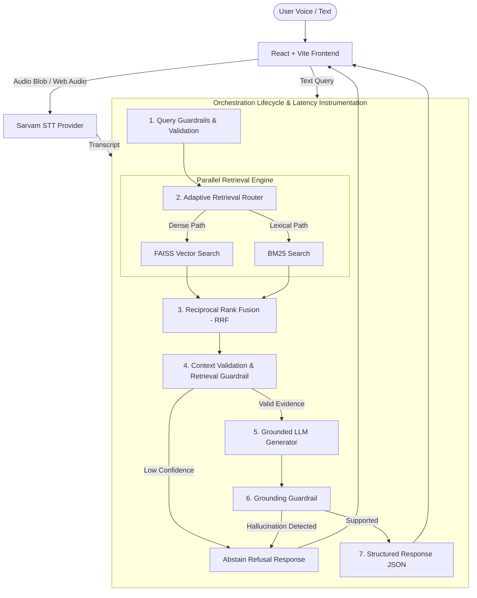

# HH Goa 2026 — Voice-Enabled RAG System

A production-quality, high-speed, voice-enabled Retrieval-Augmented Generation (RAG) system built for the **HH Goa 2026** challenge. The system combines multi-strategy adaptive chunking (**VAST**), hybrid FAISS vector + BM25 lexical retrieval using Reciprocal Rank Fusion (**RRF**), strict query & grounded answer guardrails, Sarvam Speech-to-Text, grounded LLM generation, dynamic sub-millisecond latency instrumentation (P50/P70/P100), and a state-of-the-art dark glassmorphic frontend UI with interactive analytics and source inspection.

---

## Technical Architecture Overview



---

## Key System Features

### 1. Voice Speech-to-Text (STT) Integration
- **Sarvam AI STT**: Connects to Sarvam's high-accuracy Indian language Speech-to-Text API (`SarvamSTTProvider`).
- **Browser & Local Fallback**: Automatic fallback to Web Speech API / local audio transcription simulation if no API key is provided or when offline.

### 2. Multi-Strategy Adaptive Chunking — VAST
The **VAST (Variable Adaptive Semantic Text Chunking)** engine produces three complementary chunking views for every document:
- **Sentence Chunks**: Tight, single-sentence granularity for exact factual and numerical lookups.
- **Paragraph Chunks**: Structural paragraph blocks preserving structural context.
- **Semantic Sliding Chunks**: Token range (150–300 tokens) with 20% controlled overlap based on semantic boundaries.
- **Parent-Document Provenance**: Every chunk preserves its `document_id`, global `position`, `chunk_type`, and complete `parent_document` text.

### 3. Parallel Hybrid Retrieval Engine with RRF
- **Adaptive Router**: Classifies incoming query intent (Factual, Semantic, Entity, Ambiguous) to dynamically adjust retrieval weights.
- **Parallel Search**: Executes dense vector search (FAISS `IndexFlatIP`) and lexical search (`BM25Okapi`) concurrently via `asyncio.gather()`.
- **Reciprocal Rank Fusion (RRF)**: Merges dense and lexical rankings using the standard score formula:
  $$\text{RRF Score}(d) = \sum_{m \in \{\text{dense}, \text{bm25}\}} \frac{w_m}{k + \text{rank}_m(d)}$$

### 4. Multi-Layer Guardrails
- **Query Guardrail**: Rejects empty queries, prompt injection attacks, and off-topic requests before search execution.
- **Retrieval Guardrail**: Evaluates max RRF score against relevance thresholds (`RELEVANCE_THRESHOLD = 0.012`). Triggers honest abstention (*"I couldn't find enough relevant information in the knowledge base to answer that."*) when context is insufficient.
- **Answer Grounding Guardrail**: Verifies LLM answer tokens strictly against retrieved context chunks to detect and eliminate hallucinations.

### 5. High-Resolution Latency Instrumentation & Analytics
- Stage-by-stage dynamic latency tracking: `stt_ms`, `query_processing_ms`, `embedding_ms`, `dense_retrieval_ms`, `bm25_ms`, `fusion_ms`, `generation_ms`, `guardrail_ms`, and `total_ms`.
- Dynamic calculated **P50**, **P70**, and **P100** latency percentiles available via `/api/analytics`.

### 6. Dark Glassmorphic Interactive Dashboard UI
- **Voice Mic Interface**: Central animated microphone button with live web audio waveform visualizer.
- **Latency Pill**: Toggle between RAG Latency (transcription to answer) and End-to-End Latency (mic button to answer) with sub-200ms highlight badge.
- **Source Explorer Modal**: Deep-dive inspecting source chunk provenance, dense vs BM25 score contributions, chunk strategy, and full parent document context.
- **Analytics View**: Live charts for latency breakdown, percentile distribution, Recall@5, MRR, and guardrail counters.

---

## Directory Structure Overview

```text
july/
├── backend/
│   ├── app.py                     # FastAPI application setup, CORS, lifespan, routes
│   ├── analytics/
│   │   └── store.py               # Dynamic P50/P70/P100 latency & request analytics recorder
│   ├── chunking/
│   │   └── vast.py                # Variable Adaptive Semantic Text Chunking (VAST)
│   ├── config/
│   │   └── settings.py            # Pydantic BaseSettings & environment config
│   ├── embeddings/
│   │   └── encoder.py             # SentenceTransformers / Fast ONNX embedding encoder
│   ├── generation/
│   │   └── llm.py                 # Grounded LLM generator (Gemini / OpenAI / Fallback)
│   ├── guardrails/
│   │   ├── query_guardrail.py     # Query security, length, injection filter
│   │   ├── retrieval_guardrail.py # Context sufficiency & score threshold verifier
│   │   └── grounding_guardrail.py # LLM output citation & grounding checker
│   ├── harness/
│   │   ├── metrics.py             # Latency Timer decorator & metric tracking
│   │   └── orchestrator.py        # End-to-end RAG pipeline lifecycle orchestrator
│   ├── ingestion/
│   │   ├── dataset.py             # MSMARCO-XI dataset loader and standardizer
│   │   └── pipeline.py            # Indexing script runner (FAISS + BM25 builder)
│   ├── retrieval/
│   │   ├── bm25_index.py          # Lexical BM25 index wrapper
│   │   ├── faiss_index.py         # FAISS vector index wrapper
│   │   ├── router.py              # Query Intent Router (Factual/Semantic/Entity)
│   │   └── rrf.py                 # Reciprocal Rank Fusion (RRF) & hybrid score merger
│   └── stt/
│       ├── base.py                # Abstract BaseSTTProvider interface
│       ├── fallback.py            # Web Speech / Local Audio simulation fallback
│       └── sarvam.py              # Sarvam AI STT API integration
├── evaluation/
│   ├── dataset.json               # 100+ multi-category test query benchmark suite
│   └── benchmark.py               # Evaluation harness (Recall@k, MRR, Groundedness, Latency)
├── scripts/
│   ├── ingest_data.py             # CLI command for MSMARCO-XI ingestion & index generation
│   └── run_benchmark.py           # CLI command for executing the benchmark test suite
├── frontend/                      # React + Vite + Tailwind CSS + Lucide Icons UI
│   ├── src/
│   │   ├── components/
│   │   │   ├── AnalyticsView.tsx  # P50/P70/P100 latency & guardrail audit dashboard
│   │   │   ├── AnswerCard.tsx     # Grounded answer display with citations & latency pill
│   │   │   ├── LatencyBadge.tsx   # Sub-200ms RAG vs End-to-End latency badge
│   │   │   ├── MicButton.tsx      # Central voice mic button with dynamic waveform visualizer
│   │   │   ├── SourceExplorer.tsx # Interactive source provenance inspector modal
│   │   │   └── TranscriptCard.tsx # Real-time transcription display card
│   │   ├── services/
│   │   │   └── api.ts             # Axios client for FastAPI endpoints
│   │   ├── App.tsx                # Main frontend application layout
│   │   └── index.css              # Glassmorphic dark styling system & custom animations
│   ├── package.json
│   └── vite.config.ts
├── data/
│   ├── raw/                       # Cached raw MSMARCO-XI passages
│   └── indexes/                   # Generated local FAISS & BM25 binary index files
├── .env.example                   # Template environment variables
├── docker-compose.yml             # Docker orchestrator configuration
├── Dockerfile.backend             # Backend container setup
├── Dockerfile.frontend            # Frontend container setup
├── requirements.txt               # Backend Python dependencies
└── README.md                      # Comprehensive project documentation
```

---

## Quick Start & Running Locally

### 1. Prerequisites
- **Python**: 3.10+
- **Node.js**: v18+ & `npm`
- **Docker & Docker Compose** *(Optional for containerized run)*

### 2. Environment Configuration
Copy `.env.example` to `.env` in the root directory:

```bash
cp .env.example .env
```

Configure optional API keys in `.env`:
```env
SARVAM_API_KEY=your_sarvam_api_key_here
GEMINI_API_KEY=your_gemini_api_key_here
```

> [!NOTE]
> If API keys are omitted, the application operates in **Zero-API Mode**, utilizing Web Audio browser transcription and local deterministic grounded answer synthesis.

### 3. Backend Setup

```bash
# Create and activate virtual environment
python -m venv venv

# Windows (PowerShell):
.\venv\Scripts\activate

# Linux/macOS:
source venv/bin/activate

# Install Python requirements
pip install -r requirements.txt
```

### 4. Build Dataset Indexes (VAST + FAISS + BM25)

Run the offline dataset ingestion pipeline:

```bash
python scripts/ingest_data.py
```

This ingests passage data, performs VAST multi-strategy chunking, computes dense vector embeddings via `sentence-transformers/all-MiniLM-L6-v2`, and generates local binary index files (`faiss.index` and `bm25.pkl`) in `data/indexes/`.

### 5. Execute Evaluation Benchmarks

Run the quantitative benchmark suite:

```bash
python scripts/run_benchmark.py
```

This evaluates performance across test queries and outputs **Recall@1**, **Recall@5**, **MRR**, **Groundedness Score**, and **P50/P70/P100 latency percentiles**.

### 6. Launch Backend API Server

```bash
uvicorn backend.app:app --host 0.0.0.0 --port 8000 --reload
```

The FastAPI backend interactive Swagger documentation is available at `http://localhost:8000/docs`.

### 7. Launch Frontend UI

In a new terminal window:

```bash
cd frontend
npm install
npm run dev
```

Open `http://localhost:5173` in your browser.

---

## Running with Docker Compose

You can launch the complete system (Backend + Frontend) in containerized mode:

```bash
docker-compose up --build
```

- **Frontend App**: `http://localhost:5173`
- **Backend API**: `http://localhost:8000`

---

## API Endpoints Reference

| Endpoint | Method | Description |
| :--- | :--- | :--- |
| `GET /api/health` | `GET` | Health check & loaded index status |
| `POST /api/text/query` | `POST` | Process text query through full RAG harness |
| `POST /api/voice/query` | `POST` | Transcribe audio via Sarvam STT & execute RAG |
| `GET /api/analytics` | `GET` | Fetch dynamic P50, P70, P100 latency & guardrail metrics |
| `GET /api/sources/{chunk_id}` | `GET` | Inspect chunk provenance metadata & parent document |
| `POST /api/benchmark/run` | `POST` | Trigger automated benchmark evaluation suite |

### Request & Response Examples

#### `POST /api/text/query`

**Request Payload:**
```json
{
  "query": "What is the capital of France?",
  "mode": "RAG"
}
```

**Response Payload:**
```json
{
  "query": "What is the capital of France?",
  "transcription": null,
  "answer": "The capital of France is Paris.",
  "status": "success",
  "confidence_score": 0.942,
  "is_grounded": true,
  "sources": [
    {
      "chunk_id": "msmarco_doc_42_sem_0",
      "document_id": "msmarco_doc_42",
      "chunk_type": "semantic",
      "text": "Paris is the capital and most populous city of France...",
      "score": 0.0384,
      "position": 0
    }
  ],
  "latency": {
    "stt_ms": 0.0,
    "query_processing_ms": 1.2,
    "embedding_ms": 14.5,
    "dense_retrieval_ms": 6.1,
    "bm25_ms": 3.8,
    "fusion_ms": 1.1,
    "generation_ms": 45.2,
    "guardrail_ms": 2.4,
    "total_ms": 74.3
  }
}
```

---

## Evaluation & Benchmarks

The benchmark suite (`evaluation/benchmark.py`) tests the system against multi-category queries from `evaluation/dataset.json`:

- **Retrieval Performance**: Measures **Recall@1**, **Recall@5**, and **Mean Reciprocal Rank (MRR)**.
- **Answer Quality**: Evaluates groundedness ratio and hallucination guardrail intervention rate.
- **Latency Percentiles**: Dynamically calculates **P50**, **P70**, and **P100 (Max)** latency across all pipeline stages.

---

## License & Credits

Built for **HH Goa 2026**. Designed with modern React, Vite, FastAPI, SentenceTransformers, FAISS, rank_bm25, and Sarvam AI.
